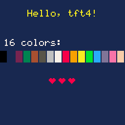
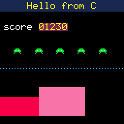
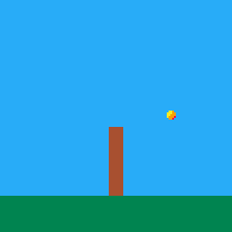
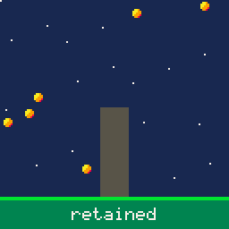
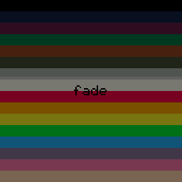
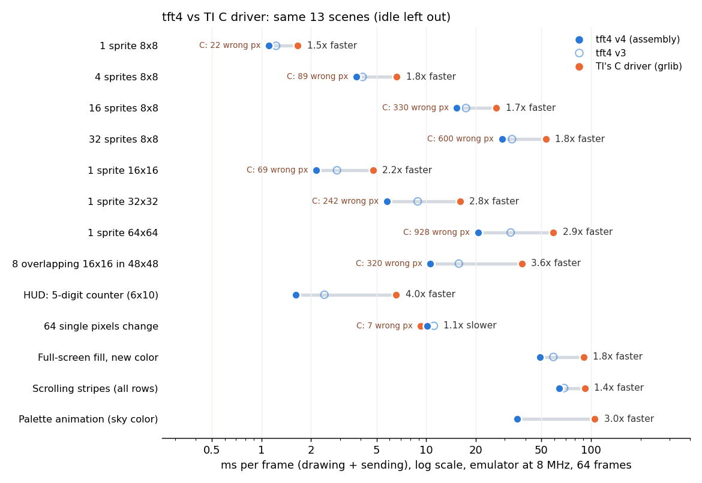

# tft4: a 16-color display driver in MSP430 assembly

tft4 drives the 128x128 color TFT (ST7735) on the **Educational BoosterPack MKII**, plugged into an **MSP-EXP430FR6989 LaunchPad**.

- It draws into 16-color frame buffers in FRAM.
- On each present, it sends only the pixels that changed since the last frame.
- The data goes over SPI by DMA while the CPU prepares the next chunk.

On the board, tft4 is **1.2x to 5.3x faster than TI's C driver** (grlib + Crystalfontz driver, same board, 8 MHz) in every scene that draws something. It is also pixel-exact: sprites are transparent and can overlap without damaging each other or the background.

It is written in the style of the Pong_Assembly project, and it can be called from assembly or from C.

```
Frame time on the board, 8 MHz, average of 64 frames (TFT4_Bench / TI_C_Bench)

scene              TI C driver   tft4     tft4 vs C
1 ball 8x8            2.01 ms    1.03 ms   2.0x faster
32 balls 8x8         64.15 ms   27.06 ms   2.4x faster
1 ball 64x64         64.10 ms   19.64 ms   3.3x faster
8 overlapping 16x16  42.84 ms   10.04 ms   4.3x faster
HUD counter           8.30 ms    1.56 ms   5.3x faster
64 single pixels     11.28 ms    9.59 ms   1.2x faster
full-screen fill     88.18 ms   46.20 ms   1.9x faster
palette change      103.58 ms   34.40 ms   3.0x faster
```

## Repository layout

```
tft4/
  driver/                   the driver: this is what goes into your project
    tft4.asm                  the driver (TI assembler)
    tft4_config.inc           settings: clock, SPI divider, orientation, tuning
    font6x8.asm               6x8 font for FbText (grlib's fixed font)
    tft4.h                    C interface
  examples/                 small, complete programs (section 5)
  demo/                     CCS project: bouncing sprites, delta vs full present
  bench/
    TFT4_Bench/             CCS project: the 14 benchmark scenes on tft4
    TI_C_Bench/             CCS project: the same scenes on TI's C driver
    suite/                  both drivers in the emulator, results, chart
  tools/
    sprite2asm.py           text art / PNG -> sprite data (.asm or .c)
    font6x8.py              regenerates font6x8.asm
    sync_driver.sh          copies driver/ into the projects that use it
    test/                   MSP430 emulator and tests (section 11)
  docs/img/                 screenshots used in this README
```

The game, **TFT4 Invaders**, has its own repository (`tft4-invaders`, next to this one).

## Quick start

1. Make a new CCS project for the MSP430FR6989: *Empty assembly-only project* for assembly, or *Empty project (with main.c)* for C.
2. Copy the four files from `driver/` into it.
3. Copy one of the `examples/` files into it as your main program. For C, delete the generated `main.c` first.
4. For a C project, set **Build → Compiler → Processor Options → code model = small, data model = small**.
5. Build and flash.

`examples/hello.asm` or `examples/hello.c` shows a title, the 16 palette colors, sprites and text on the panel.

---

## Contents

1. [The basics: why this is hard](#1-the-basics-why-this-is-hard)
2. [How tft4 works](#2-how-tft4-works)
3. [How it got fast: the optimizations](#3-how-it-got-fast-the-optimizations)
4. [Using the driver](#4-using-the-driver)
5. [Examples](#5-examples)
6. [API reference](#6-api-reference)
7. [Sprites, text and colors](#7-sprites-text-and-colors)
8. [Settings](#8-settings)
9. [Benchmarks](#9-benchmarks)
10. [Example programs](#10-example-programs)
11. [Testing without the board](#11-testing-without-the-board)
12. [Resources, limits and ideas](#12-resources-limits-and-ideas)

---

## 1. The basics: why this is hard

### The hardware

| Part | What matters here |
|---|---|
| **MSP430FR6989** | 16-bit CPU at up to 16 MHz, **2 KB of RAM** and **128 KB of FRAM**. FRAM is non-volatile memory that can be written almost as fast as RAM, so large buffers can live there. It also has a 3-channel DMA controller and eUSCI serial ports. |
| **ST7735 panel** | 128x128 pixels, 16 bits per pixel (RGB565: 5 bits red, 6 green, 5 blue). It has its own frame memory (GRAM); whatever is written there stays on the glass. |
| **The link** | SPI, 1 bit per clock: eUSCI_B0 on P1.4 (clock) and P1.6 (data). A separate **D/C pin** (P2.3) tells the panel whether a byte is a command or data. CS is P2.5 and reset is P9.4. |

To draw, you send three commands and then the pixels:

1. **CASET** with the first and last column,
2. **RASET** with the first and last row,
3. **RAMWR**, followed by 2 bytes per pixel. The panel fills the window row by row.

### SPI is the bottleneck

One full screen is 128 × 128 × 2 = **32,768 bytes**. At 8 MHz SPI one byte takes 1 µs, so **a full screen takes at least 32.8 ms**. At 16 MHz SPI it takes 16.4 ms. That makes "clear and redraw everything" at 30 frames/s impossible at 8 MHz.

Every window also has a fixed cost: 11 bytes of commands and parameters, plus the wait for the bus to empty before each D/C switch. That comes to about 75 µs per window at 8 MHz.

So the fastest driver is the one that **sends the fewest bytes and opens the fewest windows**. The CPU work only matters when it can't hide behind the SPI.

### Why a frame buffer is hard, and how tft4 fits one

A driver can only send "just the changes" if it remembers what is on the glass. A 16-bit frame buffer needs 32 KB, and the chip has 2 KB of RAM.

tft4 uses **4 bits per pixel** (16 colors from a palette): 8 KB per buffer, kept in **FRAM**. It has three of them (Back, Front and Bg, 25 KB with a lookup table). The palette maps each 4-bit index to an RGB565 color when the pixel is sent.

TI's C driver has no frame buffer. It sends every drawing call straight to the panel. So it can't know what is underneath a sprite (no transparency), and when a sprite moves it must erase and redraw the whole rectangle.

---

## 2. How tft4 works

```
 your drawing calls                 LcdPresent
 FbBlit / FbFillRect ...   ┌────────────────────────────────┐        SPI (DMA)
 ───────────────────────►  │ Back  (what you drew)          │ ──┐   ┌──────────┐
   mark touched bytes      │ Front (what is on the glass)   │   ├──►│  ST7735  │
   per row (DirtyLo/Hi)    │ Bg    (saved background)       │   │   │   GRAM   │
                           └────────────────────────────────┘   │   └──────────┘
                             compare Back with Front, but only  │
                             in the touched part of each row;   │
                             send changed runs, copy them into  │
                             Front ─────────────────────────────┘
```

**Three buffers** (8 KB each, in FRAM):

- **Back** is where all drawing goes. It keeps its contents between frames.
- **Front** is an exact copy of what the panel shows.
- **Bg** is an optional saved background (`FbSaveBg`). `FbRestore` copies a rectangle of it back into Back to erase a sprite.

**Touched ranges.** Every drawing call records, for each row it touches, the first and last byte touched (`DirtyLo`/`DirtyHi`, 256 B of RAM). `LcdPresent` skips untouched rows entirely and compares only inside the touched range. A frame with a few sprites looks at a few hundred bytes instead of 8 KB. If nothing was drawn at all, it returns at once.

**Runs and windows.** Inside a row, Back and Front are compared 4 pixels (one word) at a time:

- A changed run grows while changes keep coming within `MERGE_GAP` (3 words). Resending up to 12 unchanged pixels is cheaper than opening another window.
- Each window reaches from its row to the bottom of the screen. When the next row changes over the same columns, its pixels just keep streaming with no new commands, so a full-screen change is a single window.
- Before a new window is opened, an unchanged first or last byte is trimmed off the run.

**Sending.** Each Back byte holds 2 pixels. A 1 KB table in FRAM (`PairTab`, built from the palette) turns it into the 4 bytes to send, in one lookup:

1. The CPU fills a 128-byte RAM line buffer.
2. DMA channel 0 feeds the other buffer to the SPI, one byte per TXIFG.
3. The two buffers swap.

The CPU work hides behind the SPI, so a full refresh runs at the SPI's speed. Every byte that is sent is also copied into Front in the same loop. `LcdPresent` returns while the last chunk is still going out; `LcdWait` waits for it.

**Two ways to draw a frame:**

- **Retained (fastest).** Draw the scenery once and call `FbSaveBg`. Each frame:
  1. `FbRestore` each sprite's old rectangle,
  2. `FbBlit` each sprite at its new place,
  3. call `LcdPresent`.

  The cost follows only what moved. Erase all sprites before drawing any, so no erase wipes a sprite drawn earlier in the same frame.
- **Full redraw (simplest).** Each frame: `FbClear`, draw everything, `LcdPresent`. Every row gets compared (about 1.8 ms at 16 MHz), but still only the changes are sent. TFT4 Invaders works this way.

---

## 3. How it got fast: the optimizations

Every step was measured on the board (demo, 12 sprites / 4 sprites, present only) or with the benchmarks.

| Version | Change | Full refresh | 12 sprites | 4 sprites |
|---|---|---|---|---|
| v1 | 4 bpp buffers, delta present, CPU sends every byte | ~57 ms | ~12 ms | ~7 ms |
| v2 | **DMA streaming** from two RAM line buffers, CPU expands in parallel | **~33.5 ms** (SPI-bound) | 9–11 ms | ~6 ms |
| v3 | **Touched ranges** per row, **retained drawing** with a background layer, Front updated while sending (no buffer swap) | ~34 ms | **~7.5 ms** | **~2.5 ms** |
| v4 | Faster drawing (below), `FbPixel`, `FbText`, early return when nothing was drawn | same | same present, drawing ~2x faster | |
| v5 | **16 MHz** CPU and SPI (`ClockInit`, FRAM wait state) | ~19 ms | 1.55–1.8x faster in every benchmark scene (section 9) | |
| v6 | Packaging: settings in `tft4_config.inc`, `FbRestoreSpr`, `PaletteLoad`, `Tft4ClockMHz`, a C header, examples, `sync_driver.sh` | | | |

What each step taught:

- **v1 → v2: move the bytes with DMA.** Pushing bytes with the CPU costs about 14 cycles each, which is slower than the 8-cycle SPI byte. With DMA, the CPU only expands pixels (via `PairTab`) into one buffer while DMA sends the other. A full refresh became SPI-bound.
- **The one tricky DMA detail.** The trigger is the TXIFG *edge*. Each chunk is started by writing its first byte by hand while the bus is idle, and DMA sends the rest. `DMARMWDIS` keeps DMA out of the middle of read-modify-write instructions.
- **v2 → v3: learn from TI's C driver.** The C driver's cost follows what you draw. It doesn't redraw and compare the whole screen every frame.
  - Recording touched ranges gave tft4 the same property.
  - The background layer (`FbSaveBg`/`FbRestore`) made erasing cheap and correct.
  - Copying into Front while sending removed an 8 KB copy per frame.
- **v4: make drawing cheap.** Once presents were fast, drawing was a large share of a frame.

  | Operation | Change | Before | After |
  |---|---|---|---|
  | `FbFillRect`, `FbRestore` | write whole words, 2 per loop pass | 14 ms (full-screen fill) | 4 ms |
  | `FbBlit` | 2 pixels per step through a 256-byte mask table (`MaskTab`); odd x uses a nibble-swap table and carries half a byte forward | 186 µs (8x6 sprite) | 92 µs |
  | `FbPixel` (new) | direct nibble write | 23 µs (as a 1x1 fill) | 6 µs |

- **v5: 16 MHz.** Everything, SPI included, is clocked from SMCLK, so doubling the clock should roughly halve every number. FRAM needs one wait state above 8 MHz; its cache hides most of it.

Ideas that were measured and dropped:

- **Merging windows more aggressively**: widening runs to the open window, filling short vertical gaps, opening windows over the union of the next rows. On the benchmark scenes this was modeled at under 2% gain.
- **Sending short runs with the CPU instead of DMA.** It was slower.
- **Expanding the next run before opening its window** (to overlap the previous DMA). No gain.

The per-window cost (about 75 µs at 8 MHz) comes mostly from the three commands, each needing the bus to be empty before D/C changes. It can't be pipelined away.

### v6: making it easier to use

The last round wasn't about speed. It made the driver easier to drop into a project and share between projects:

- **Settings live in `tft4_config.inc`**, not in the driver. Each project keeps its own settings, and updating `tft4.asm` never overwrites them. Assembly programs `.include` the same file, so their timers use the same `CLOCK_MHZ` as the driver, with no second copy to keep in step. C programs read `Tft4ClockMHz`.
- **`FbRestoreSpr(sprite, x, y)`** erases a sprite by its own size. Before, every program read the width and height out of the sprite header to call `FbRestore`.
- **`PaletteLoad(16 colors)`** replaces the whole palette with one table rebuild instead of 16. `DefaultPalette` is exported, so effects can start from it.
- **`FbBack` and `FbFront` are exported** in place of the old `BackPtr`/`FrontPtr` variables, which never changed. That saves 4 bytes of RAM and two instructions.
- **One source for the driver**: `driver/`, copied into projects by `tools/sync_driver.sh`, with a `--check` mode.
- **Examples and recipes** (section 5), and the C header `tft4.h`.

Considered and left alone:

- **Linking the driver files into each CCS project instead of copying them.** Eclipse "linked resources" would avoid the copies, but it isn't clear that CCS 20 (Theia) keeps them, and copies always build.
- **Making the pins configurable.** They are fixed by the BoosterPack. Moving the driver to another LaunchPad would mean changing the eUSCI instance and the DMA trigger anyway.
- **Prefixing every routine name** (`Tft4...`). The `Lcd`/`Fb` prefixes are already distinct; only `ClockInit` and `Palette` are generic names.

---

## 4. Using the driver

### Add it to a project

Copy the contents of `driver/` into your CCS project folder:

| File | Needed for |
|---|---|
| `tft4.asm` | Always: the driver |
| `tft4_config.inc` | Always: its settings (section 8). Assembly programs can `.include` it to get `CLOCK_MHZ`. |
| `font6x8.asm` | Always: the font for `FbText`; `tft4.asm` references it |
| `tft4.h` | Only when calling from C |

Each CCS project keeps its own copies, because CCS builds the files that are in the project folder. `driver/` is the one to edit. Then run:

```
sh tools/sync_driver.sh                    # demo/ and bench/TFT4_Bench/
sh tools/sync_driver.sh ../tft4-invaders   # and any other project folders
sh tools/sync_driver.sh --check            # just report copies that differ
```

It never overwrites a project's `tft4_config.inc`, so each project keeps its own settings.

Before `LcdInit`:

1. Stop the watchdog.
2. Call `ClockInit`, which sets MCLK = SMCLK = `CLOCK_MHZ` and adds the FRAM wait state at 16 MHz. Or set the clocks yourself to match.
3. Clear `LOCKLPM5`.

The driver uses:

- eUSCI_B0 (SPI)
- DMA channel 0
- pins P1.4, P1.6, P2.3, P2.5 and P9.4

Nothing else is touched: timers, interrupts, the other DMA channels and the segment LCD are yours. Call `LcdWait` before going into a low-power mode that stops SMCLK.

### From assembly (TI C calling convention)

- Arguments go in R12, R13, R14, R15, and results come back in R12.
- The routines may change R11–R15. **R4–R10 are always kept**, so game state can live there.
- No routine uses interrupts, so the driver can be called from the main loop while your interrupts run.

```asm
	.include "tft4_config.inc"      ; CLOCK_MHZ for your timers
	...
	call    #ClockInit
	bic.w   #LOCKLPM5, &PM5CTL0
	call    #LcdInit
	mov.w   #1, R12                 ; navy
	call    #FbClear
	mov.w   #Msg, R12               ; "Hello" in yellow, no background
	mov.w   #10, R13
	mov.w   #10, R14
	mov.w   #10+0xFF00, R15         ; color + (background << 8)
	call    #FbText
	call    #LcdPresent
	call    #LcdWait
```

### From C

```c
#include "tft4.h"

ClockInit();
PM5CTL0 &= ~LOCKLPM5;
LcdInit();
FbClear(1);
FbText("Hello", 10, 10, TFT4_TEXT(10, TFT4_CLEAR));
LcdPresent();
LcdWait();
```

- The C project must use **`--code_model=small --data_model=small`**. The driver returns with `RET`, which pairs with the small model's `CALL`. A large-model `CALLA` pushes a 20-bit return address, and `RET` would not return correctly.
- To keep your own variables in FRAM next to the driver's buffers, use `#pragma DATA_SECTION(var, ".TI.persistent")`, not `#pragma PERSISTENT`. PERSISTENT makes a "noinit" section, and the TI linker refuses to put it in the same output section as the driver's buffers (error #10367).
- For timers, `Tft4ClockMHz` holds `CLOCK_MHZ`. For example: `TA0EX0 = Tft4ClockMHz / 8 - 1;`.

## 5. Examples

Each example is one complete file. They are built and run in the emulator by `tools/test/test_examples.py`; the pictures below are what the emulated panel showed.

| | |
|---|---|
|  | **`examples/hello.asm`**: the smallest program. A title, the 16 palette colors in a loop (with the color in R4, which survives every call) and a sprite written by hand in `.byte` rows, then one `LcdPresent`. |
|  | **`examples/hello.c`**: the same kind of picture from C. It builds a line of text out of pieces (`FbText` returns the x after the text), draws opaque text on a colored background, a row of sprites, `FbPixel` dots and a rectangle clipped at the left edge. |
|  | **`examples/bounce.asm`**: retained mode in assembly. The scenery is drawn once, then `FbSaveBg`. Each frame the ball is erased with `FbRestoreSpr`, moved and drawn again. The ball passes in front of the wall without damaging it, and each frame sends only the pixels around the ball. It has a 25 Hz frame timer from `CLOCK_MHZ`. |
|  | **`examples/retained.c`**: retained mode in C with 6 overlapping balls. It shows the order that matters: erase all, move all, then draw all. |
|  | **`examples/palette_fade.c`**: palette effects. The picture is drawn once. Fading to black and back only computes a new palette (`PaletteLoad`) and resends the screen (`LcdPresentFull`); nothing is redrawn. |

### Recipes

**Choosing a mode.** Retained mode is best when most of the screen stays put (a background with sprites on top). Full redraw is simpler when everything moves or the logic is complicated (TFT4 Invaders). Either way only changed pixels are sent.

```c
/* full redraw: draw everything every frame, send only the difference */
FbClear(0);
drawEverything();
LcdPresent();

/* retained: erase what moved, draw it again */
for (i = 0; i < n; i++) FbRestoreSpr(spr[i], oldX[i], oldY[i]);
for (i = 0; i < n; i++) FbBlit(spr[i], x[i], y[i]);
LcdPresent();
```

**A HUD over retained scenery.** Opaque text is erased by the next text drawn over it, so a score can be updated without `FbRestore`. Pad it to a fixed width so shorter numbers don't leave digits behind.

```c
FbText(scoreText, 2, 1, TFT4_TEXT(10, 1));      /* yellow on navy: covers the old digits */
```

**Text centered or right-aligned.** Every character is 6 pixels wide.

```c
FbText(s, (128 - 6 * strlen(s)) / 2, y, colors);   /* centered */
FbText(s, 128 - 6 * strlen(s), y, colors);         /* right-aligned */
```

**A status bar that isn't part of the scenery.** Draw it after `FbSaveBg`, or simply never erase it: `FbRestore` only touches the rectangles you give it.

**Sprites entering the screen.** Coordinates are signed and everything is clipped, so `FbBlit(spr, -5, y)` draws the visible part. Sprites fully inside the screen horizontally take the fast path; ones cut by the left or right edge are drawn pixel by pixel (about 1.4x slower).

**Flash or fade the whole screen.** Change the palette, then send everything:

```c
PaletteSet(0, TFT4_RGB565(0x5A0818));  /* black becomes dark red */
LcdPresentFull();                      /* ~17 ms at 16 MHz */
/* next frame */
PaletteSet(0, 0x0000);
LcdPresentFull();
```

**Throwing away a frame.** If you drew into Back and then decide not to show it, `FbSync` copies Front (what is on the glass) back into Back.

**Measuring a frame.** Use a free-running timer around the drawing and `LcdPresent` + `LcdWait`:

```c
TA1EX0 = Tft4ClockMHz / 4 - 1;                   /* SMCLK / 8 / 4 -> 2 us ticks at 16 MHz */
TA1CTL = TASSEL__SMCLK | ID__8 | MC__CONTINUOUS | TACLR;
t0 = TA1R;  drawFrame();  LcdPresent();  LcdWait();  ticks = TA1R - t0;
```

**Doing other work while the last chunk goes out.** `LcdPresent` returns while DMA is still sending its last chunk (up to 128 bytes, ~64 µs at 16 MHz). You can start on the next frame's logic straight away. Only drawing calls and `LcdPresent` wait for the bus, and they do it themselves. Call `LcdWait` before sleeping in LPM3/4.

**Sprites from art.** Draw them as text and generate the data:

```
sprite Ship            '.' = transparent, 1-9 and A-F = palette index
....7....
...C7C...
.CCCCCCC.
```

```
python3 tools/sprite2asm.py ships.txt -o ships.asm     # for assembly
python3 tools/sprite2asm.py ships.txt -o ships.c       # for C: ships.c + ships.h
```

---

## 6. API reference

| Routine | Arguments | Does |
|---|---|---|
| `ClockInit` | – | MCLK = SMCLK = `CLOCK_MHZ` from the DCO, FRAM wait state at 16 MHz. ACLK is left alone. |
| `LcdInit` | – | Pins, SPI, DMA, panel reset and init, default palette, black screen |
| `FbClear` | R12 = color | Fill Back (~1.4 ms at 16 MHz) |
| `FbFillRect` | R12 = x, R13 = y, R14 = w + (h << 8), R15 = color | Filled rectangle, clipped; x and y may be negative |
| `FbPixel` | R12 = x, R13 = y, R14 = color | One pixel, clipped (~3 µs) |
| `FbBlit` | R12 = sprite, R13 = x, R14 = y | 4 bpp sprite, index 0 transparent, clipped, any x |
| `FbText` | R12 = string, R13 = x, R14 = y, R15 = color + (background << 8) → R12 = x after | 6x8 text, string ends with 0. A background ≥ 16 means transparent. Characters not fully on screen are skipped. |
| `FbSaveBg` | – | Back → Bg (after drawing the scenery) |
| `FbRestore` | R12 = x, R13 = y, R14 = w + (h << 8) | Bg → Back for that rectangle (erase a sprite), clipped |
| `FbRestoreSpr` | R12 = sprite, R13 = x, R14 = y | `FbRestore` of the sprite's own size: erase a sprite drawn at x, y |
| `FbSync` | – | Front → Back (throw away drawing that wasn't presented) |
| `LcdPresent` | → R12 = windows opened | Send what changed in the touched rows |
| `LcdPresentFull` | → R12 = 1 | Send all of Back (after a palette change) |
| `LcdWait` | – | Wait until the last byte is on the wire |
| `PaletteLoad` | R12 = address of 16 RGB565 words | Replace the whole palette (one table rebuild, ~0.35 ms). `LcdInit` loads `DefaultPalette` this way. |
| `PaletteSet` | R12 = index, R13 = RGB565 | Change a palette entry (~0.35 ms). Pixels already on the glass keep their old color until they are sent again, so call `LcdPresentFull` to recolor everything. |

C versions of all of these are in `tft4.h`, with helpers `TFT4_WH(w, h)`, `TFT4_TEXT(ink, bg)`, `TFT4_CLEAR` and `TFT4_RGB565(0xRRGGBB)`. These are exported too:

- `Palette`: the current palette, in RAM.
- `DefaultPalette`
- `Font6x8`
- `Tft4ClockMHz`: the `CLOCK_MHZ` setting, as a word.
- `FbBack` and `FbFront`: the buffers, for debugging.

Times are at 16 MHz, from the emulator.

---

## 7. Sprites, text and colors

**Default palette** (index: color). It is the PICO-8 palette; change it with `PaletteSet`.

`0 black · 1 navy · 2 plum · 3 dark green · 4 brown · 5 dark grey · 6 light grey · 7 white · 8 red · 9 orange · 10 yellow · 11 green · 12 sky blue · 13 lavender · 14 pink · 15 peach`

In sprites, index 0 is transparent, so draw dark details with navy (1) rather than black.

**Sprite format:**

- `.byte width, height`
- then the rows, 2 pixels per byte, left pixel in the high nibble
- each row padded to a whole byte

Draw them as text (`sprites.txt`):

```
sprite Crab
..9....9..        '.' = transparent, 1-9 and A-F = palette index
...9999...
```

Then generate the data:

```
python3 tools/sprite2asm.py sprites.txt -o sprites.asm     # assembly
python3 tools/sprite2asm.py sprites.txt -o sprites.c       # C: sprites.c + sprites.h
python3 tools/sprite2asm.py hero.png -o sprites.asm        # PNG, colors snap to the palette
```

**Text.** `FbText` uses grlib's fixed 6x8 font (characters 32–126; others print as `?`). It costs about 45 µs per character at 16 MHz. For bigger text, scale the font yourself from `Font6x8`: each character is 8 bytes, one per row, with bit 5 as the leftmost pixel. TFT4 Invaders' title does this with one `FbFillRect` per run of pixels.

**Palette tricks.**

- **Recolor everything at once:** a flash, a fade, day and night. Change entries, then call `LcdPresentFull` (~17 ms at 16 MHz).
- **Cheap color cycling:** changing an entry recolors only pixels sent afterwards. Pair it with drawing that changes anyway.

---

## 8. Settings

All settings are in `tft4_config.inc`, one copy per project.

| Setting | Default | Meaning |
|---|---|---|
| `CLOCK_MHZ` | 16 | The clock `ClockInit` sets and the delays assume. Programs read the same value (`.include` or `Tft4ClockMHz`) for their timers. |
| `SPI_DIV` | 1 | SPI clock = SMCLK / `SPI_DIV`. 16 MHz is above the ST7735's rated ~15 MHz write clock. If the picture is garbled or shifted, set 2. |
| `LCD_MADCTL`, `LCD_X_OFF`, `LCD_Y_OFF` | 0xC8, 2, 3 | Orientation and panel offsets. These are TI's "up" orientation, confirmed on the board. |
| `MERGE_GAP` | 3 | Unchanged words (4 px each) resent to avoid opening a window |
| `CHUNK` | 32 | Back bytes per DMA line buffer (128 SPI bytes) |

---

## 9. Benchmarks

Three tools measure the same 14 scenes:

- idle
- 1, 4, 16 and 32 moving 8x8 balls
- one ball at 16x16, 32x32 and 64x64
- 8 overlapping balls
- a HUD counter
- 64 random pixels
- a full-screen fill
- scrolling stripes
- palette animation

| Where | What |
|---|---|
| `bench/TFT4_Bench` (asm) | tft4 on the board. S1 runs the next scene; S2 runs all and shows a summary table. The segment LCD shows the scene number and average ms. |
| `bench/TI_C_Bench` (C) | The same program on TI's C driver (grlib + Crystalfontz + HAL), built with TI's compiler at -O3 |
| `bench/suite/suite.py` | Both drivers in the MSP430 emulator. It also counts **wrong pixels** against an ideal picture. |

The scene data for all three is generated from `suite.py`, so they run identical frames.

**Board, 8 MHz** (average ms, 64 frames):

| Scene | TI C | tft4 | tft4 vs C |
|---|---|---|---|
| Idle | 0.01 | 0.01 | same |
| 1 ball 8x8 | 2.01 | 1.03 | 2.0x faster |
| 4 balls 8x8 | 8.03 | 3.52 | 2.3x faster |
| 16 balls 8x8 | 32.08 | 14.30 | 2.2x faster |
| 32 balls 8x8 | 64.15 | 27.06 | 2.4x faster |
| 1 ball 16x16 | 5.36 | 2.00 | 2.7x faster |
| 1 ball 32x32 | 17.58 | 5.42 | 3.2x faster |
| 1 ball 64x64 | 64.10 | 19.64 | 3.3x faster |
| 8 overlapping | 42.84 | 10.04 | 4.3x faster |
| HUD counter | 8.30 | 1.56 | 5.3x faster |
| 64 pixels | 11.28 | 9.59 | 1.2x faster |
| Full fill | 88.18 | 46.20 | 1.9x faster |
| Stripes | 89.98 | 60.99 | 1.5x faster |
| Palette | 103.58 | 34.40 | 3.0x faster |



**Correctness.** In the emulator suite:

- tft4 matched the ideal picture in all 14 scenes.
- The C driver left 22–928 wrong pixels in every scene with sprites:
  - black boxes around sprites (no transparency),
  - stars erased under them,
  - overlapping sprites wiping each other.

**Board, 16 MHz** (tft4, `CLOCK_MHZ` 16, SPI at 16 MHz, 2026-09-27). The panel worked at 16 MHz SPI with no errors.

| Scene | tft4 8 MHz | tft4 16 MHz | 16 MHz speedup |
|---|---|---|---|
| Idle | 0.01 | 0.01 | – |
| 1 ball 8x8 | 1.03 | 0.63 | 1.63x |
| 4 balls 8x8 | 3.52 | 2.20 | 1.60x |
| 16 balls 8x8 | 14.30 | 9.00 | 1.59x |
| 32 balls 8x8 | 27.06 | 16.98 | 1.59x |
| 1 ball 16x16 | 2.00 | 1.25 | 1.60x |
| 1 ball 32x32 | 5.42 | 3.41 | 1.59x |
| 1 ball 64x64 | 19.64 | 12.50 | 1.57x |
| 8 overlapping | 10.04 | 6.40 | 1.57x |
| HUD counter | 1.56 | 1.00 | 1.56x |
| 64 pixels | 9.59 | 5.95 | 1.61x |
| Full fill | 46.20 | 27.79 | 1.66x |
| Stripes | 60.99 | 37.13 | 1.64x |
| Palette | 34.40 | 19.36 | 1.78x |

- **Speedup:** 1.55–1.8x, not the full 2x. Above 8 MHz the FRAM needs a wait state, and the frame buffers are read and written in FRAM on every present. The emulator doesn't model that, so it predicted exactly 2x.
- **The limit:** a full-screen resend (palette) takes 19.4 ms against the SPI minimum of 16.4 ms, so it is 85% of the bus rate.
- **Against TI's C driver at 8 MHz:** tft4 at 16 MHz is 1.9x (64 pixels) to 8.3x (HUD) faster. For example, 32 balls go from 64.15 to 16.98 ms. TI_C_Bench can also run at 16 MHz (`bench_clock.h`) for a same-clock comparison.

---

## 10. Example programs

| Where | Language | Shows |
|---|---|---|
| `examples/` | Assembly and C | Five short programs (section 5) |
| `demo/` | Assembly | Bouncing sprites in retained mode. S1 switches between delta and full present, S2 between 4 and 12 sprites. The segment LCD shows the present time. |
| `bench/TFT4_Bench`, `bench/TI_C_Bench` | Assembly / C | The benchmark scenes (section 9) |
| `tft4-invaders` (its own repo) | C | A full game in full-redraw mode: 16-color sprites, a 3-layer starfield, explosion particles, a palette flash, scaled title text |

To open a project: in CCS, **File → Import Projects**, then pick `demo/`, `bench/TFT4_Bench` or `bench/TI_C_Bench`.

---

## 11. Testing without the board

Everything was developed against `tools/test/msp430emu.py`, an MSP430 emulator written for this project. It models:

- the base instruction set with cycle counts,
- eUSCI_B0 SPI with TX-buffer timing,
- DMA channel 0 on TXIFG edges,
- Timer_A0/A1,
- the segment LCD registers,
- an ST7735 that decodes CASET, RASET, RAMWR and COLMOD and checks the reset order and D/C timing.

On the board, the emulator's numbers came out 3–8% slower than the real hardware in every scene, so its predictions are slightly pessimistic. It doesn't model FRAM wait states, which only matter at 16 MHz.

```
sh tools/test/build.sh . /tmp/tb                        # TI syntax -> llvm-mc via ti2gnu.py
python3 tools/test/test_tft4.py /tmp/tb/tft4.elf        # driver vs a Python reference
python3 tools/test/test_demo.py /tmp/tb/demo.elf /tmp/tb   # the demo from RESET
python3 tools/test/test_examples.py . <msp430 include_gcc folder> /tmp/ex   # every example
sh tools/sync_driver.sh --check                         # project copies match driver/
```

The benchmark projects have their own emulator tests: `bench/TFT4_Bench/tools/test/` and `bench/TI_C_Bench/test/`. The C builds need TI's msp430 headers (`ccs/ccs_base/msp430/include_gcc` in the CCS install) and clang.

`test_tft4.py` checks the following against a Python reference model, including clipping and odd x:

- 311 rectangles
- 307 pixels
- all 95 characters plus 80 random strings
- 400 sprite blits
- 40 random frames and 60 retained-mode frames, where the panel must match after every present
- that every call keeps R4–R10 and SP
- that D/C never changes while a byte is shifting out

It needs `llvm-mc` and `ld.lld` (version 18), clang for the C examples, and `pip install pyelftools pillow`.

Two CCS gotchas:

- The llvm linker scripts are named `*.lds.txt` because CCS hands every `.ld`/`.cmd` file in a project to the TI linker.
- Test-only C files are named `*.c.txt` because CCS compiles every `.c` file.

---

## 12. Resources, limits and ideas

| | Size |
|---|---|
| Code | 2.8 KB |
| Tables | 0.6 KB (`MaskTab`, `SwapTab`, init sequence, palette) |
| Font | 0.76 KB |
| FRAM buffers | 25 KB: Back, Front and Bg (8 KB each) plus `PairTab` (1 KB) |
| RAM | 596 B: two 128 B DMA line buffers, 256 B of touched ranges, palette, text tables |

**Limits:**

- 16 colors at a time. The palette is free to change.
- Sprites up to 255x255. Text is only 6x8, unless you scale it yourself.
- Only the small code and data model from C.
- The frame buffers take about a fifth of the FRAM.

**Ideas:**

- Hardware-scrolling the panel (ST7735 vertical scroll) for scrolling games.
- A second font.
- A `FbLine` routine.
- Double-height pixels (128x64 logical) for 2x fewer bytes per change.

---

## License

The tft4 driver, tools, examples, demo, benchmarks and tests are under the **MIT License** (`LICENSE`).

The 6x8 font data (`font6x8.asm`, converted from TI's grlib) and the TI code that `bench/TI_C_Bench` uses for comparison (GrLib, DriverLib, the Crystalfontz driver) keep **TI's BSD 3-clause license**. See `THIRD_PARTY_NOTICES.md` and `licenses/TI-BSD-3-Clause.txt`.
